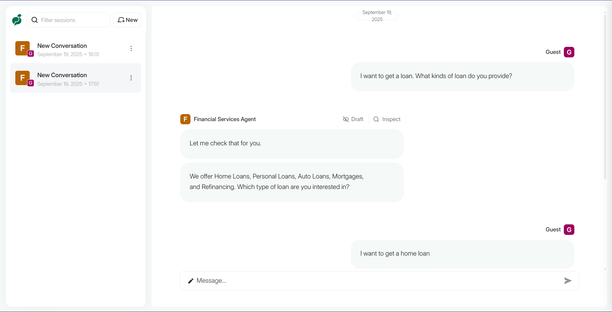
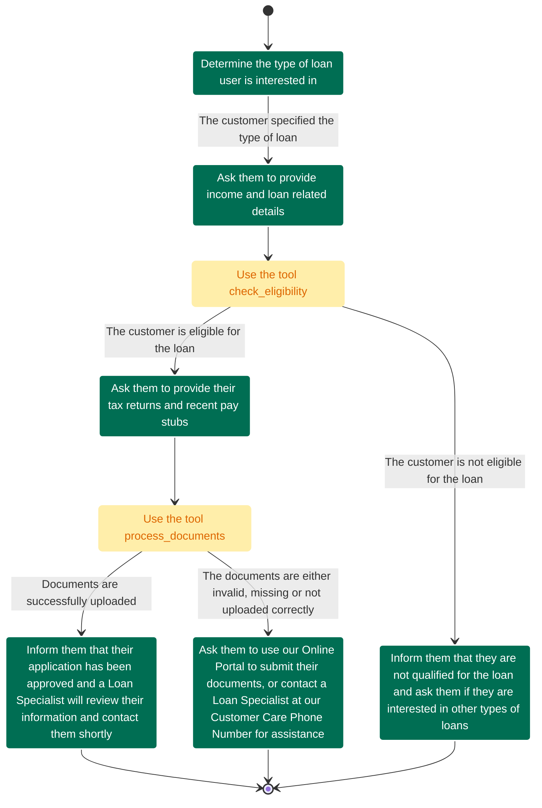

# Loan Approval Conversational Agent

A compliance-driven conversational AI agent that guides customers through a structured loan approval process.

## Overview

This project implements a financial services chatbot that helps customers navigate the loan application process. The agent uses a state-based journey to guide users through eligibility checks, document collection, and approval workflows while maintaining compliance with financial service standards using deterministic and rule-based behavioral patterns.

## Installation

1. **Prerequisites**:
- Python 3.12+

2. **Install dependencies:**
    First, install `uv` and set up the environment:
    ```bash
    # MacOS/Linux
    curl -LsSf https://astral.sh/uv/install.sh | sh

    # Windows
    powershell -ExecutionPolicy ByPass -c "irm https://astral.sh/uv/install.ps1 | iex"
    ```

    Then install project dependencies:
    ```bash
    # Create virtual environment and activate it
    uv venv
    source .venv/bin/activate  # MacOS/Linux
    .venv\Scripts\activate     # Windows

    # Install dependencies
    uv sync
    ```

3. **Set up environment variables:**
    ```bash
    # Create a .env file with your OpenAI API key
    echo OPENAI_API_KEY=your-api-key-here > .env
    ```

## Usage

Run the main application:
```bash
uv run main.py
```

This will start the server locally on port 8800 with the loan approval agent configured and ready to handle customer interactions.



## Loan Approval Flow

The agent follows a structured conversational journey for processing loan applications:



## Project Structure

```
loan-approval-agent/
├── main.py                      # Application entrypoint
├── app/
│   ├── __init__.py
│   ├── config.py                # Environment & config loading
│   ├── agent.py                 # Agent creation & orchestration
│   ├── glossary.py              # Domain-specific terminology
│   ├── guidelines.py            # Agent behavioral guidelines
│   ├── tools/                   # Tool definitions
│   │   ├── eligibility.py       # Credit eligibility check
│   │   ├── documents.py         # Document processing
│   │   ├── rates.py             # Interest rate lookup
│   │   └── loan_types.py        # Available loan products
│   └── journeys/                # Conversational journey definitions
│       └── loan_approval.py     # Loan approval state machine
├── pyproject.toml
└── .env                         # API keys (gitignored)
```

## Key Components

### Tools
- **`check_eligibility`**: Validates customer creditworthiness based on credit score, income, and loan amount
- **`process_documents`**: Simulates document validation for tax returns and pay stubs
- **`get_current_rates`**: Fetches current interest rates by location
- **`get_loan_types`**: Returns available loan products

### Agent Capabilities
- Domain-specific terminology understanding
- Compliance guidelines for financial advice limitations
- Structured conversation flow management
- Human handoff protocols
